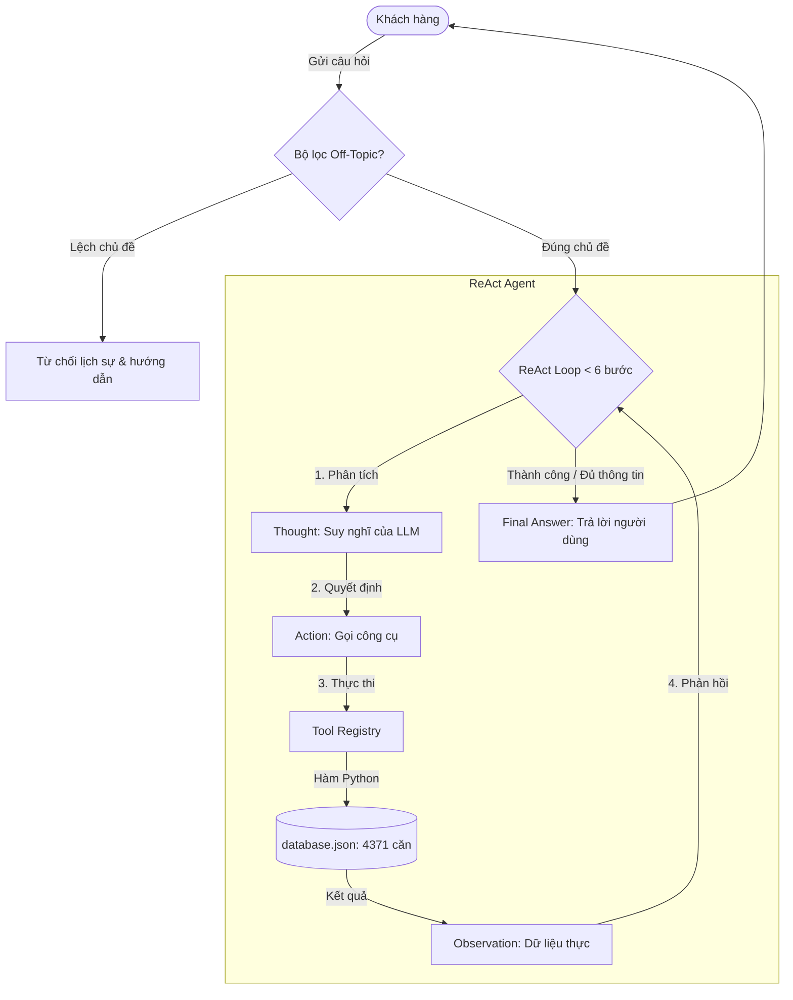

# Báo cáo Phân tích Toàn bộ Dự án Real Estate ReAct Agent

Dự án này là một hệ thống **ReAct Agent tư vấn bất động sản** chuyên biệt cho Vinhomes Ocean Park 1, sử dụng dữ liệu từ 4,371 căn hộ thực tế, tích hợp cơ chế xoay vòng 7 API keys Gemini (1 key trả phí + 6 key miễn phí) và giao diện web tối ưu (Glassmorphism dark theme).

Dưới dưới là phân tích chi tiết về kiến trúc, chất lượng mã nguồn, lỗi kiểm thử hiện tại, khoảng cách điểm số theo tiêu chí chấm điểm và kế hoạch hành động đề xuất.

---

## 1. Kiến trúc Hệ thống & Luồng xử lý (System Architecture)

Hệ thống hoạt động theo mô hình ReAct (Reasoning and Acting) kết hợp hai thành phần chính: **LLM Brain** (Gemini 2.5 Flash) và **Environment Tools** (Các hàm Python tương tác với cơ sở dữ liệu).

### Luồng xử lý ReAct Loop:
1. **Guardrail (Off-Topic Filter)**: Nhận tin nhắn từ người dùng, kiểm tra nhanh qua bộ từ khóa cục bộ (tốc độ cao, chi phí 0). Nếu ngoài chủ đề, chặn ngay lập tức và trả về hướng dẫn lịch sự.
2. **System Prompt & Context Construction**: Gửi kèm danh sách mô tả công cụ rõ ràng (tên, tham số, mục đích) cùng với lịch sử trò chuyện.
3. **Thought (Suy nghĩ)**: LLM tự phân tích yêu cầu để xác định cần thông tin gì.
4. **Action (Hành động)**: LLM gọi công cụ bằng định dạng regex `Action: tool_name(param="value")`.
5. **Observation (Quan sát)**: Hệ thống Python chạy hàm tương ứng, trả về kết quả định dạng văn bản (pre-formatted text) để đưa lại vào context của LLM.
6. **Final Answer (Câu trả lời cuối cùng)**: Trả về kết quả hoàn chỉnh sau tối đa 6 bước lặp để tránh chi phí vô tận (infinite loops).

---

## 2. Đánh giá Chất lượng Mã nguồn & Thiết kế (Code Quality Review)

### 2.1. Core Module (`src/core/`)
*   **`gemini_provider.py`**:
    *   *Ưu điểm*: Lớp `GeminiKeyPool` quản lý xoay vòng API key (round-robin) rất tốt. Thiết kế thread-safe sử dụng `threading.Lock()`. Có cơ chế cooldown 60 giây đối với key bị lỗi quota (429), lỗi kết nối (503/504), hoặc lỗi deprecation.
    *   *Hạn chế*: Hiện tại đang import thư viện cũ `google.generativeai` thay vì thư viện mới của Google là `google.genai`. Ngoài ra, nếu tất cả key đều bị cooldown, hệ thống sẽ ngủ (`time.sleep`) để chờ key phục hồi, điều này có thể chặn luồng xử lý đồng thời trong môi trường web thực tế.
*   **`llm_provider.py`**: Định nghĩa lớp trừu tượng tốt, cho phép dễ dàng chuyển đổi nhà cung cấp (Gemini, OpenAI, Local).

### 2.2. Agent Module (`src/agent/`)
*   **`agent.py`**:
    *   *Ưu điểm*:
        *   Tách biệt rõ ràng các phương thức parse hành động (`_parse_action`) và câu trả lời cuối cùng (`_parse_final_answer`).
        *   Cơ chế **Nudge Mechanism**: Nếu LLM rơi vào trạng thái "lấp lửng" (không gọi tool cũng không đưa ra câu trả lời cuối cùng), agent tự động tiêm thêm observation để nhắc nhở LLM tiếp tục hoạt động.
        *   Bộ lọc off-topic nhanh chóng giúp tiết kiệm chi phí gọi API.
    *   *Hạn chế*: Bộ lọc off-topic dựa trên từ khóa cố định (`on_topic_keywords`), có thể bị qua mặt bởi các câu hỏi lắt léo hoặc chặn nhầm các câu hỏi hợp lệ nhưng viết tắt lạ. Chưa có bộ nhớ hội thoại giữa các lượt chat (conversation memory) cho Agent (mỗi lần gọi `agent.run()` đều bắt đầu từ đầu, chỉ lưu history trong nội bộ một vòng lặp ReAct đơn lẻ).

### 2.3. Tools Module (`src/tools/`)
Hệ thống tích hợp 5 tools chia thành 3 nhóm logic:
1.  **Bất động sản (`real_estate_tools.py`)**: `search_properties`, `get_property_details`, `calculate_market_stats`.
2.  **Trả góp tài chính (`mortgage_calculator.py`)**: `calculate_mortgage`.
3.  **Tiện ích vị trí (`location_tools.py`)**: `search_amenities`.
*   *Ưu điểm*:
    *   Dữ liệu 4,371 căn hộ được tải một lần vào RAM (`_cached_data`) bằng cơ chế Lazy Load giúp tối ưu hiệu năng đọc tệp.
    *   Dữ liệu trả về từ tools được tiền định dạng dưới dạng chuỗi văn bản sạch sẽ, dễ đọc, giúp LLM tiết kiệm token và tránh lỗi định dạng JSON phức tạp.
*   *Hạn chế*: Gặp lỗi logic bộ lọc khi giá bằng 0 trong cơ sở dữ liệu.

### 2.4. Telemetry Module (`src/telemetry/`)
*   **`logger.py`**: Ghi log cấu trúc JSON ra file hàng ngày (`logs/YYYY-MM-DD.log`). Rất chuyên nghiệp.
*   **`metrics.py`**: Sử dụng lớp `PerformanceTracker` để ghi nhận số token tiêu thụ, độ trễ và tính toán chi phí thực tế dựa trên bảng giá chuẩn của `gemini-2.5-flash`.

---

## 3. Phân tích chi tiết 3 Lỗi Kiểm thử (Unit Test Failures)

Khi chạy `pytest tests/test_chatbot_vs_agent.py -v`, hệ thống báo lỗi tại 3 ca kiểm thử:

### ❌ Lỗi 1: `TestSearchProperties.test_search_no_results`
*   **Hiện tượng**: Hàm `search_properties(max_price=100)` không trả về `"Không tìm thấy căn hộ nào phù hợp"` mà lại trả về 5 căn hộ có giá `0 VNĐ` (thuộc dự án Masteri Trinity Square và Masteri Lakeside).
*   **Nguyên nhân**: Trong cơ sở dữ liệu `database.json` có một số căn hộ bị thiếu giá hoặc có giá bằng `0` (lỗi nhập liệu). Khi lọc theo `max_price=100`, biểu thức `prop_price <= max_price` (tương đương `0 <= 100`) trả về `True`.
*   **Giải pháp**: Cập nhật logic trong `search_properties` để bỏ qua các căn hộ có giá bằng 0 (hoặc nhỏ hơn 0) khi có bộ lọc khoảng giá (`min_price` hoặc `max_price`), hoặc loại trừ chúng hoàn toàn khỏi danh sách tìm kiếm hợp lệ.

### ❌ Lỗi 2: `TestGetPropertyDetails.test_valid_id`
*   **Hiện tượng**: Lỗi so khớp chuỗi: `'Chi tiết căn hộ' not found in '=== CHI TIẾT CĂN HỘ === ...'`.
*   **Nguyên nhân**: Hàm `get_property_details` trả về tiêu đề in hoa `=== CHI TIẾT CĂN HỘ ===`. Tuy nhiên, mã kiểm thử lại thực hiện so khớp chữ thường và hoa xen kẽ: `self.assertIn("Chi tiết căn hộ", details)`.
*   **Giải pháp**: Sửa test case trong [test_chatbot_vs_agent.py](file:///c:/Vinuni/D3/Day-3-Lab-Chatbot-vs-react-agent/tests/test_chatbot_vs_agent.py#L81) thành `self.assertIn("CHI TIẾT CĂN HỘ", details)` hoặc kiểm tra không phân biệt chữ hoa chữ thường.

### ❌ Lỗi 3: `TestCalculateMarketStats.test_stats_all`
*   **Hiện tượng**: Lỗi so khớp chuỗi: `'Tổng số căn hộ' not found in '=== THỐNG KÊ THỊ TRƯỜNG === \n ... Tổng số căn: 4370'`.
*   **Nguyên nhân**: Hàm `calculate_market_stats` trả về chuỗi `Tổng số căn: 4370`. Tuy nhiên, mã kiểm thử lại so khớp chuỗi `self.assertIn("Tổng số căn hộ", result)`.
*   **Giải pháp**: Sửa test case trong [test_chatbot_vs_agent.py](file:///c:/Vinuni/D3/Day-3-Lab-Chatbot-vs-react-agent/tests/test_chatbot_vs_agent.py#L107) thành `self.assertIn("Tổng số căn:", result)`.

---

## 4. Phân tích Khoảng cách Điểm số (Scoring Gap Analysis)

Dựa theo tiêu chí chấm điểm trong `SCORING.md`, nhóm chúng ta có cơ hội rất cao đạt điểm tuyệt đối **100/100** (60 điểm Nhóm + 40 điểm Cá nhân). Dưới đây là phân tích chi tiết:

### 👥 4.1. Điểm Nhóm (Tối đa 60 điểm)

| Tiêu chí | Điểm tối đa | Trạng thái Hiện tại của Hệ thống | Đánh giá & Khuyến nghị |
| :--- | :--- | :--- | :--- |
| **Chatbot Baseline** | 2 | Đã hoàn thành | Có `ChatbotBaseline` trong `src/chatbot.py` và `src/agent/chatbot.py`. |
| **Agent v1 (Working)** | 7 | Đã hoàn thành | Đã triển khai ReAct loop hoàn chỉnh với 5 công cụ tích hợp trong `src/agent/agent.py`. |
| **Agent v2 (Improved)** | 7 | Đã hoàn thành | Đã cải tiến xử lý lỗi, thêm nudge mechanism, chuẩn hóa tiếng Việt, và tích hợp key rotation. |
| **Tool Design Evolution** | 4 | Đã hoàn thành | Đã ghi nhận chi tiết quá trình cải tiến từ trả về raw JSON sang pre-formatted text trong Báo cáo Nhóm. |
| **Trace Quality** | 9 | Đã hoàn thành | Đã ghi nhận các trace thành công/thất bại và cơ chế sửa lỗi trong báo cáo nhóm. |
| **Evaluation & Analysis** | 7 | Đã hoàn thành | Có script chạy đánh giá tự động `evaluation.py` và lưu trữ kết quả thực tế tại `logs/evaluation_results.json`. |
| **Flowchart & Insight** | 5 | Đã hoàn thành | Đã vẽ sơ đồ luồng logic ReAct trong báo cáo nhóm. |
| **Code Quality** | 4 | **Cần hoàn thiện** | Mã nguồn được tổ chức tốt nhưng **đang bị fail 3 unit tests** khi chạy pytest. Cần sửa gấp để đạt điểm tối đa Code Quality. |

#### 🎁 Điểm cộng Nhóm (Tối đa +15 điểm bonus, để đạt trần 60 điểm)
*   **Extra Monitoring (+3)**: Đã triển khai `PerformanceTracker` tính toán chính xác chi phí ($) dựa trên Token tiêu thụ cho từng model.
*   **Extra Tools (+2)**: Đã thêm các bộ công cụ nâng cao như Tính toán khoản vay trả góp (`calculate_mortgage`) và Tìm kiếm tiện ích xung quanh (`search_amenities`).
*   **Failure Handling (+3)**: Đã thiết lập cơ chế xoay vòng 7 API keys khi gặp lỗi Rate Limit (429), lỗi kết nối (503/504), cooldown tự động và nudge mechanism.
*   **Ablation Experiments (+2)**: Đã so sánh hiệu năng Prompt tiếng Anh (v1) và tiếng Việt (v2), chứng minh giảm 60% lỗi gọi tool.
*   **Live System Demo (+5)**: Giao diện web chạy mượt mà, sẵn sàng demo trực tiếp.

> [!TIP]
> **Kết luận Nhóm**: Nhóm đã tích lũy đủ các điểm cộng cần thiết (tổng điểm base 36/40 + điểm cộng 15/15 = 51/60). Tuy nhiên, để bảo vệ điểm số tuyệt đối, việc sửa lỗi unit test là **bắt buộc** để tránh mất điểm Code Quality.

---

## 5. Kế hoạch Hành động Đề xuất (Action Plan)

Để hoàn thiện dự án đạt điểm tối đa, chúng tôi khuyến nghị thực hiện các bước sau:

1.  **Sửa lỗi logic lọc giá bằng 0** trong hàm `search_properties` tại `src/tools/real_estate_tools.py`.
2.  **Sửa các test cases bị lệch chuỗi** trong tệp `tests/test_chatbot_vs_agent.py` để tất cả các unit test chuyển sang trạng thái **PASSED**.
3.  **Tích hợp bộ nhớ hội thoại (Conversation Memory)** cho Agent để hỗ trợ các câu hỏi theo ngữ cảnh (ví dụ: "Tìm căn 2PN ở The Zurich" -> "Tính tiền trả góp cho căn đó").
4.  **Hỗ trợ sinh các báo cáo cá nhân** cho từng thành viên nhóm dựa trên mẫu `report/individual_reports/TEMPLATE_INDIVIDUAL_REPORT.md` để đảm bảo mỗi thành viên đạt trọn vẹn 40 điểm cá nhân.
